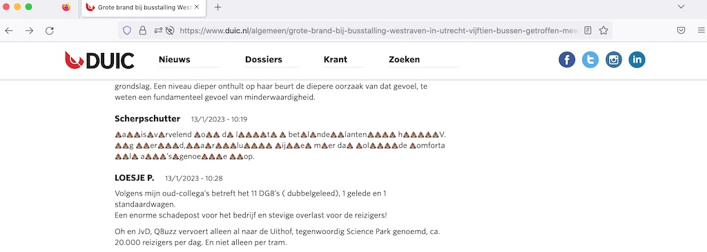

<a href="../../"> read in English </a>

# DUIC shitposters text masker
Wie poep praat, praat poep, letterlijk. Deze Firefox browser Add-on verandert de tekst van sommige beruchte DUIC reaguurders in poep. 

[DUIC](https://www.duic.nl) is een lokaal Utrechts nieuwsplatform. Het is een waardevolle bron van lokaal nieuws, maar er zitten enkele beruchte reaguurders op. Deze add-on probeert niet hun bestaan te ontkennen, maar geeft een beetje verlichting op een ludieke manier.

  

  
# Installatie

### Manual

1. [Download](https://github.com/rommelzooi/duic-shitposters-text-masker/raw/main/duic_shitposters_text_masker-0.1.3.xpi) the add-on naar je computer
2. Open Firefox
3. Sleep the file (duic_shitposters_text_masker-0.1.3.xpi) op het Firefox window
4. Bevestig dat je de extensie wilt installeren in de pop-up
5. Geniet van DUIC zoals je normaal zou doen

### Extensions store 

Wordt aan gewerkt.

# Verder

In de toekomst zou het leuk zijn als deze tool ook voor andere platforms kan werken.
